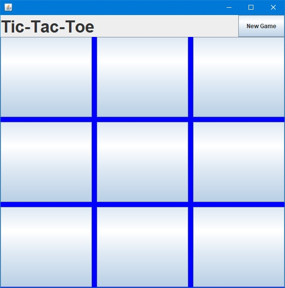
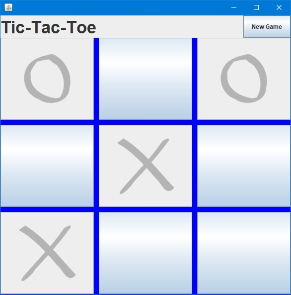
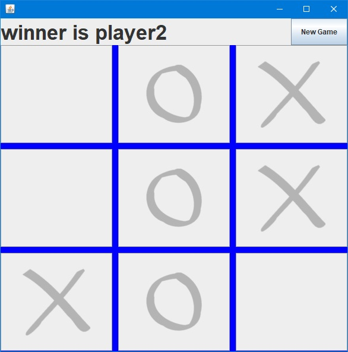
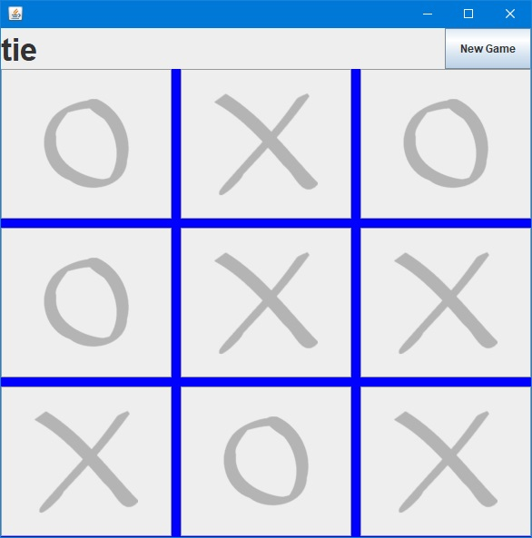

# TicTacToeGame

> Tic tac toe game using Java.

## Table of Contents
* [General Information](#general-information)
* [Technologies Used](#technologies-used)
* [Setup](#setup)
* [Screenshots](#screenshots)
* [Sources](#sources)

## General Information
Project allows play tic tac toe with AI opponent.\
AI was created using Minimax algorithm with alpha-beta pruning.

## Technologies Used
- Java - version 14
- Swing

## Setup
To run this project download the executable file from link above and click it. Runs only on Windows machine.

## Screenshots
1\
\
2\
\
3\
\
4\

## Sources
- https://en.wikipedia.org/wiki/Minimax
- https://en.wikipedia.org/wiki/Alpha%E2%80%93beta_pruning
- https://www.youtube.com/watch?v=trKjYdBASyQ
- https://www.youtube.com/watch?v=l-hh51ncgDI
